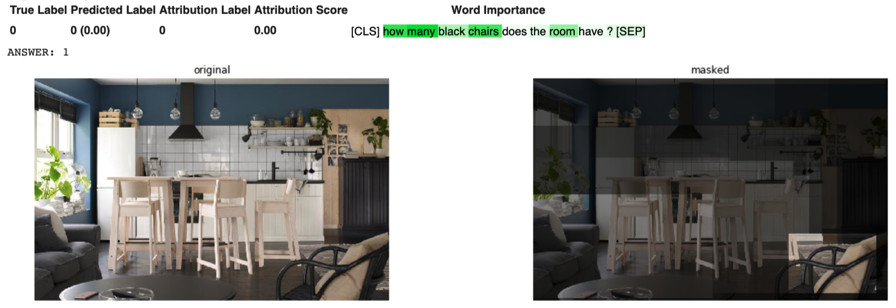
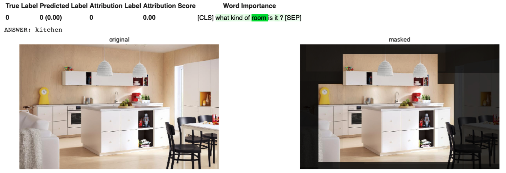
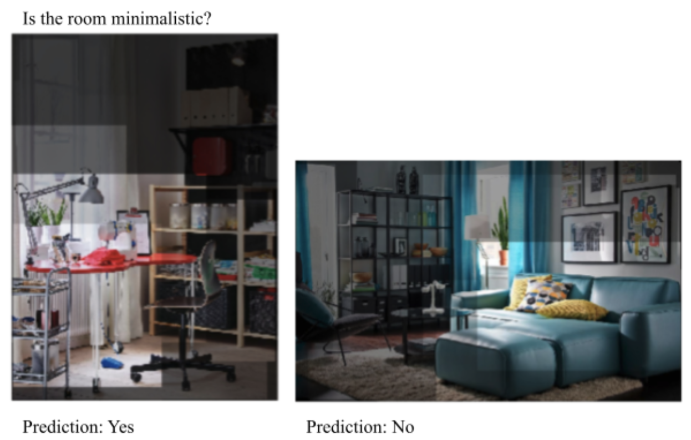

## AI Design: Testing Vision Transformers on Design Images

This blog article is written by [Sun-Young HA](https://medium.com/@sunyoungha) & Stefan PASCH

In recent years, advancements in artificial intelligence have been omnipresent. AI is applied in various fields and for various applications, such as *language translation, customer segmentation*, or *fraud detection*. An obvious form of AI that could support and complement the work of designers are algorithms that are able to detect images and understand various features of images with potential applications in design: For example, an AI that can classify fashion in different categories, can detect furniture in images of interior design, or classify the design style in images.

While initial forms of AI could only conduct very narrow image tasks, e.g. distinguish the image of a dog from a cat image, in recent years, AI shows increasingly general abilities to detect and analyze images. In this article, we will focus on a particular kind of AI, so-called **transformer-based models** that simultaneously provide visual and language understanding. As we will see, these models inherit, on the one hand, a remarkable general understanding of images and, on the other hand, can be applied fairly flexible for different purposes.

We find that vision transformers, in fact, show a solid performance in various tasks, on a dataset of IKEA interior design images, suggesting that such tools could become increasingly important for designers.

### A Very Short History of ‘Image Recognition’

20 to 30 years ago, most computer-assistant programs relied on **rule-based approaches**, that is, computers are given well-defined rules on how to behave in certain situations. For example, a bank may use the algorithm to decline all loan requests when the client’s balance is below -1000$ and grant all loans for higher balances. As images are extremely complex, however, these simple if-then conditions fall short when trying to analyze images. Say, for example, you would like to develop an algorithm that is able to distinguish between images of cats and dogs. When considering the image of a cat, one realizes how difficult it is to put into words what actually makes it a picture of a cat. A cat has two eyes, two ears, and a nose, but so have dogs and humans. So, simple **if-then-conditions** won’t help us much here.

That’s where **neural networks** jumped in. Roughly speaking, neural networks reflect a complex relationship between input variables (the color shades of an image) and an output variable (cat or dog) by using thousands, often millions, of neurons/parameters. By doing so, neural networks, can detect nuanced differences between images, for example, distinguish the shape of ears or eyes, or learn what kind of postures cats and dogs tend to have. This resulted in remarkable performances in image classification, like distinguishing a dog from a cat image. However, a huge downside remained: An AI could be only applied to the narrow task it had been trained on. For instance, an AI trained to distinguish cats from dogs could not detect a human. Hence, each specific application needs a particular dataset and training.

### Vision Transformers

The basis for the **visual-language model** we discuss, actually, stems from the field of **text-based AI (NLP — Natural Language Processing)**. Here, in recent years there has been a shift away from keyword- and rule-based approaches, towards large neural networks that contain a general understanding of language. Most notably, in 2018, Google introduced there **BERT (Bidirectional Encoder Representations from Transformers)** that could set new high scores in various NLP tasks, such as *question answering* and *text classification*. For example, BERT understands that the search phrase “2019 brazil traveller to USA need a visa” wants to know about a Brazilian applying for VISA in the U.S. and about a U.S. citizen in brazil.

The basic idea behind this technology is that large neural networks are trained on different language tasks, such as predicting which word belongs to a particular sentence, allowing the model to learn a general understanding of language. This “*general language understanding*” can then be applied and fine-tuned on particular problems, such as text classification.

**Vision Transformers** incorporate this concept into image recognition. Here, the visual embeddings of the images, on the one hand, and the text embeddings of image captions, on the other hand, are used as inputs. Via cross-modal training, the model learns a joint understanding of text and images. Correspondingly, the model is not just able to classify images or detect objects but also to respond to specific text questions.

### Visual Transformer for IKEA Data

Let us see how vision transformers work in practice on a potential design application. To do so, we use an open-source framework, **transformer-explainability**, that utilizes the **LXMERT** visual transformer model and integrates an explainability interface, which highlights the image parts on which basis the model made its decision. We apply this on a **dataset of IKEA interior design images**.

#### 1. Object Detection

First, we test if the vision transformer can detect objects in room sceneries from IKEA. To evaluate the textual understanding, we not just ask the model to detect certain furniture types, but also to distinguish them by color. For example, the image below shows six chairs, albeit just one of them being black. When we ask the model “how many black chairs does the room have?” it actually understands that we are just interested in identifying black chairs and correctly answers “1”.

#### 2. Detect Room-Type

Next, we classified each room type of the dataset. Just by typing the question "**what kind of room is it?**"; the model understands remarkably well what kind of answers are required (living room, bedroom, kitchen etc.), though the model has not been trained as a room-classifier on this kind of dataset. The picture below illustrates this with an example. The model not just classifies the room correctly as a kitchen, but with transformer-MM-explainability, we can also learn from which features the model made this inference: Due to the oven, the kitchen island, and the kitchen sink our model thinks that the room is a kitchen.

When classifying the whole IKEA dataset, the model functions remarkably well, with an accuracy of 69% when using the initial labelling of the IKEA dataset as ground truth. Note that the dataset also contains various images, like hallways or combined eating and living rooms, that may not necessarily belong in one certain room type.

#### 3. Room Features

Besides classifying the rooms, we can also ask questions about design styles or certain features of a room. For example, whether the style is minimalistic or not. See below two examples. For the office shown below, the model perceives the room as minimalistic, and the explainer suggests to us that this is due to the simple desk, chair, and lamb. The living room, on the other hand, is predicted as not minimalistic and we learn that this is mainly due to the spacious couch and the various images on the wall.

### Discussion
Though the vision transformer model was not trained or fine-tuned for the analyzed data of interior design images, it provides a solid understanding of different types of tasks. This suggests that AI models like this could be of increasing importance for designers. For example, an AI like the one demonstrated could help furniture companies, like IKEA, to automatically analyze which kind of design features they currently offer, and which aspects might be missing. Similarly, tools like the one demonstrated can help to build up a scalable design search engine. Most search engine rely on text data, i.e., in the context of design images the descriptions given to design items or sceneries. However, customers may be interested in design features that are not given in the text descriptions, such as a minimalistic style. Moreover, there could be an avenue for designers to foster design research, form factors, or design trend.

Read on [Medium](https://medium.com/@sunyoungha/ai-design-testing-vision-transformers-on-design-images-a79f60c0840a)

### References

[1]Devlin, J., Chang, M. W., Lee, K., & Toutanova, K. (2018). Bert: Pre-training of deep bidirectional transformers for language understanding. arXiv preprint arXiv:1810.04805.

[2]https://blog.google/products/search/search-language-understanding-bert/

[3]Chefer, H., Gur, S., & Wolf, L. (2021). Generic Attention-model Explainability for Interpreting Bi-Modal and Encoder-Decoder Transformers. arXiv preprint arXiv:2103.15679.

[4]Tan, H., & Bansal, M. (2019). Lxmert: Learning cross-modality encoder representations from transformers. arXiv preprint arXiv:1908.07490.

[5]Tautkute, I., Możejko, A., Stokowiec, W., Trzciński, T., Brocki, Ł., & Marasek, K. (2017, September). What looks good with my sofa: Multimodal search engine for interior design. In 2017 Federated Conference on Computer Science and Information Systems (FedCSIS) (pp. 1275–1282). IEEE.
