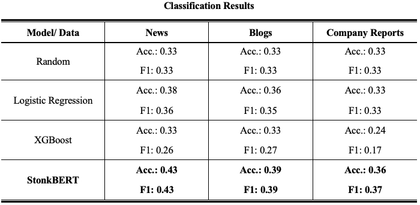
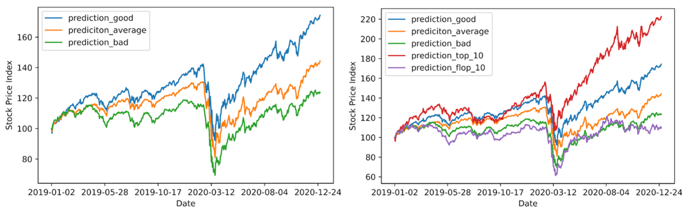

## Stonkbert: Can Language Models Predict Medium-Run Stock Price Movements?

Article written by Daniel Ehnes and Stefan Pasch. Find the full paper [here](https://arxiv.org/abs/2202.02268)[1].

Recent years have seen one of the biggest advancements in AI research in the field of Natural Language Processing (NLP). By shifting away from rule-based attempts to analyze language towards large neural networks, modern transformer models are able to capture a general understanding of language. Most notably, in 2018 Google has published its **transformer-based neural network BERT** (Bidirectional Encoder Representations from Transformers)[2]. With this and similar transformer-based language models new high scores could be set in various NLP tasks and applications, such as question-answering, fact-checking or hate-speech detection.

Unsurprisingly, such language models have since been applied to predict stock prices based on company-related text data, such as tweets and corporate disclosures (For example, see the excellent articles of Babbe[3] and Aktan[4]). However, this work has mostly focused on the stock movements just a few days after the corresponding documents have been published. Yet, many investors do not engage in day-trading and are interested in stock performance over a longer time. Moreover, most language models that tried to predict stock prices analyzed a single source of text data, e.g., only company reports. However, some types of company-related text data may be more informative than others.

Therefore, with StonkBERT, we focus on the following main questions:

- 1. Can Language-Models predict the performance of a stock **one year** after the publication of related text data?
- 2. If yes, is it dependent on the type of document that is used in the analysis? (We investigate three types of documents that are commonly used for this purpose: **News articles, blogs, and annual company reports)**

#### Getting Stock-Related Text Data and Stock Prices

**Stock-Related Text Data**: We scrutinize three types of company-related text data: We use a dataset on historical financial news from Gennadiyi[5]. The dataset covers company-specific news articles (henceforth “news”) and stock market opinion pieces (which we label as “blogs”). Further, we retrieved annual reports as filed with the Securities and Exchange Commission (SEC), the so-called Form-10K filings.

We cover articles from 2012 to 2019 and consider the 250 companies with the most articles in the dataset of historical financial news.

**Stock Prices**: For these companies, we gathered daily stock price data from Yahoo Finance. To distinguish individual price movements from general market trends, we look at the abnormal price in- or decreases for each stock, that is, a stock’s price change compared to the average price change of the market. These abnormal one-year return data were then split into tertiles, dividing stocks into three equally large groups, of over-, under-, and average-performers. Hence, from a random classifier, we would expect an accuracy of 33%.

**Train and Test Data**: As training data, we used the articles from 2012 to 2017. As a validation set, we used the articles published in the year 2018 and, finally, the test set includes all articles from 2019. This ensures that there is no overlap between the price movements in the training and test set.

**Training**: We fine-tuned the common BERT-Base model to classify our text data to predict the corresponding companies in over-, under-, and average-performers. (We also tested other language models, such as Roberta Large or Finbert, but they tended to have a slightly worse performance than BERT-Base.)

As benchmarks, we also tested two more traditional text classifiers. Their approach is to first transform the text data in a term frequency matrixes (TF-IDF) and then run typical machine learning algorithms, such as Logistic Regression or XGBoost. Correspondingly, they do not capture context-based knowledge.

#### Results

Our first finding is that StonkBERT consistently outperforms the traditional methods in predicting the return category, irrespective of the data source under scrutiny. In fact, in some of the cases, a random draw would have outperformed the traditional models, while the StonkBERT results are at least a little better than random with all data sources.

More importantly, we find that the text source has a sizable influence on the achieved accuracy. The lowest performance is achieved using annual reports, indicating that the information therein is largely already priced in or at least of limited long-term value to investors. In contrast, both blogs and news articles performed better. Comparing the accuracy between news and blogs, we find that the informational content in news is the highest. Our best model achieves an accuracy of 43%, i.e., 10 percentage points over a random draw. Note that this is roughly in line with the work that focuses on short-term stock price movements. For instance, Babbe et al.[3] outperform a simple one-class classifier by 5 percentage points and Sawhney et al.[6] outperform a random classifier by 10 percentage points.

#### Stock Price Performance

Next, we test if StonkBERT’s predictions also translate into differences in actual stock returns. To do so, we analyze the average abnormal one-year return in our news article test sample based on the predictions from StonkBERT.

The average performance of all companies included in our test set was 6.29%. The firms that had been predicted as “good” by StonkBERT, however, showed an average performance of 16.83% in the one-year period after the predictions were made. The firms that were predicted as “average” just showed a performance of 4.72% and the “bad” predictions of -3.17%, respectively. Correspondingly, the classification into the three performance groups was actually associated with substantial differences in the one-year stock returns. Moreover, we looked at the Top-10 predictions, which include the 10 firms where StonkBERT predicted the highest probability of being a “good” firm. Those firms outperformed the market by an even higher margin, with an average one-year return of 41%.

The following figures show the average stock price development for the different groups comprising the entire two-year period, with analyzed articles covering the entire year of 2019 only. Interestingly, we find that the firms predicted as “good” outperformed the other categories in both periods before and after the Covid related stock market crash in March 2020.

We also conducted performance simulations for articles published in the year 2018 and similarly find performance differences between the predicted categories, albeit the outperformance of StonkBERT compared to the market appeared to be more modest. The firms classified as “good” returned 12.33% on average compared to 5.24% in the whole sample.

#### Discussion
Though StonkBERT consistently outperformed a random classifier by a sizable margin, our results should be taken with a grain of salt. Among finance scholars the dominant theory is the efficient market hypothesis (Fama 1970[7]), which suggests that stock prices reflect all available information of the market, making it impossible to systematically outperform the market. Correspondingly, StonkBERT may not outperform the market in the long run.

For example, StonkBERT’s successful prediction may be the result of our specific time period, which includes very strong outperformance of tech-based stocks, in general, that was further amplified after the Covid crisis emerged. These moment-based effects have in the past been associated with increased news coverage. Correspondingly, our model may have learned that tech-based stocks outperformed their peers during the training period and inferred this trend to continue in the future. However, a purely industry-based effect should have been detected by traditional models as well. Potentially, transformer-based models may be able to pick up more fine-grained information, for example, specific technological trends within industries (e.g. cloud computing, or machine learning). In fact, when using an explainability tool we find that StonkBERT tends to associate the word “cloud” with positive abnormal stock returns. This is in line with, for example, a report from Morgan Stanley which finds that also non-tech firms that invest heavily in digitization, data, and the cloud tend to outperform their industry peers.[8]

Another interesting economic insight of our analysis is that our results suggest that news articles contain information that is the most “valuable” to an AI. Potentially, blog articles, in their speculative nature, only add noise compared to news articles, whereas the informational content of company reports may be too sparse.

#### Conclusion

So, can we all get rich by using transformer models and trade according to their recommendations? At first glance, the results are encouraging, as our news article-based model predicted well-performing firms fairly successfully. However, additional analyses are required to establish whether this observation holds long-term. A promising next step may be to test the model on a longer time horizon (e.g., five years). Finally, as previous work established that SEC Form-8K filings as a text basis also perform well, future work may want to investigate approaches that combine news information and these more frequent corporate disclosures to achieve even higher accuracy.

**DISCLAIMERS**: The views and opinions expressed in this article are those of the authors and do not reflect any views or positions of any affiliated organization of the authors. This work is for research purposes only and does not provide any financial or trading guidance.

#### References

[1]Pasch, Stefan., & Ehnes, Daniel. (2022). StonkBERT: Can Language Models Predict Medium-Run Stock Price Movements?. arXiv preprint arXiv:2202.02268.

[2]Devlin, Jacob; Chang, Ming-Wei; Lee, Kenton; Toutanova, Kristina (2018): BERT: Pre-training of Deep Bidirectional Transformers for Language Understanding. Available online at https://arxiv.org/pdf/1810.04805.

[3]Babbe, Mark; Nguyen, Cory; Lee, Won; Noueilaty, Hanny (2019): BERT is the Word: Predicting Stock Prices with Language Models. In medium.com, 3/16/2019. Available online at https://babbemark.medium.com/bert-is-the-word-predicting-stock-prices-with-languagemodels-8d5205b8537c.

[4]Aktan, Yusuf (2018): Using NLP and Deep Learning to Predict Stock Price Movements. In medium.com 1/28/2018. Available online at https://medium.com/@yiaktan/using-nlp-and-deep-learning-to-predict-the-stock-market-64eb9229e102.

[5]Gennadiy, R. (2020): us-equities-news-data. Available at: https://www.kaggle.com/gennadiyr/us-equities-news-data

[6]Sawhney, Ramit; Agarwal, Shivam; Wadhwa, Arnav; Shah, Rajiv Ratn (2020): Deep Attentive Learning for Stock Movement Prediction From Social Media Text and Company Correlations, pp. 8415–8426. DOI: 10.18653/v1/2020.emnlp-main.676.

[7]Fama, Eugene F. (1970): Efficient Capital Markets: A Review of Theory and Empirical Work. In The Journal of Finance 25 (2), p. 383. DOI: 10.2307/2325486

[8]Morgan Stanely Research (2020): What’s Technology Worth: Introducing Data Era Stocks 2.0
